## Phased Array Ultrasonic Signal Generator
Bachelor's thesis at HHU in 2015, partly reorganized in 2025.

* [Real-World Final Product](#6-final-product-demonstration) and [Real-World Experiments](#5-real-world-acoustic-experiments)
* Hardware: Cyclone IV E (Altera)
* Package Structure:

```
${project_workspace}/
├── xkz/
│   ├── xkz 
│   ├── xkz_a               // simplified
│   ├── xkz_b               // improved 
│── uart_top/
│   ├── uart_top
│   ├── uart_top_1_digital
│   ├── uart_top_1_digital_pll
│   ├── uart_top_pll(not 10ms)
│   ├── uart_top(10ms)
├── testbench/              // testbench
│   ├── xkz_test
│   ├── xkz_test1
│   ├── xkz_test2
│   ├── xkz_test3
│   ├── xkz_test4
│   ├── xkz_test5
│   ├── xkz_test6
│   ├── xkz_test7
├── hnq
├── firmware
├── assets                  // figures in README
└── README.md               
```

### 0. Abstract
### 1. Simplified Phased Array Ultrasound Signal Generator System
#### 1.1 Functional Block Diagram
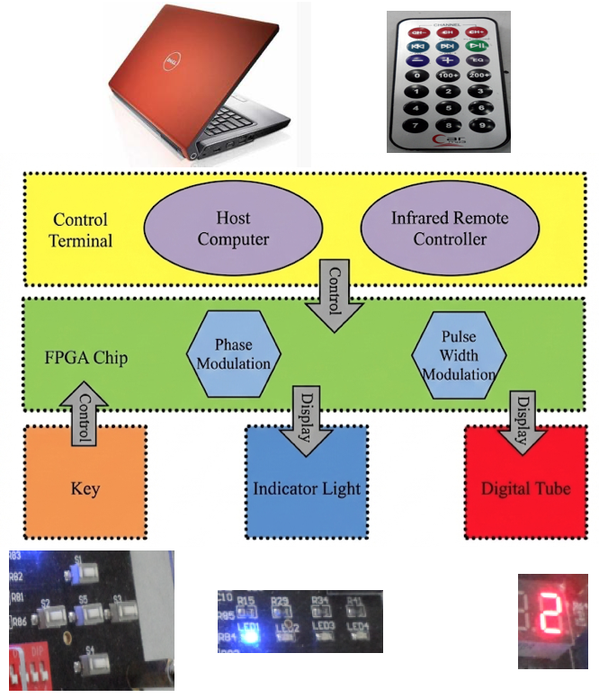

* `xkz_a` is the core generator module realized by VHDL/Verilog:
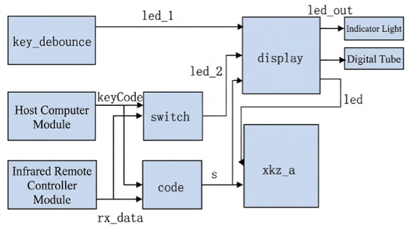

#### 1.2 Control Signals

* ASCII Codes of 13 Control Signals for Simplified Phased Array Ultrasound Signal Generator:

| Character Symbol | ASCII Code (Decimal) | ASCII Code (Binary) |
| :--- | :---: | :---: |
| 0 | 48 | 00110000 |
| 1 | 49 | 00110001 |
| 2 | 50 | 00110010 |
| 3 | 51 | 00110011 |
| 4 | 52 | 00110100 |
| 5 | 53 | 00110101 |
| 6 | 54 | 00110110 |
| 7 | 55 | 00110111 |
| 8 | 56 | 00111000 |
| 9 | 57 | 00111001 |
| a | 97 | 01100001 |
| b | 98 | 01100010 |
| c | 99 | 01100011 |

##### 1.2.1 Phase Modulation Control

* Relationship between 8-bit Input $s$ and Phase Modulation Count $d$:

| 8-bit Input $s$ | Phase Modulation Count $d$ |
| :---: | :---: |
| 00110000 | 1 |
| 00110001 | 2 |
| 00110010 | 3 |
| 00110011 | 4 |
| 00110100 | 5 |
| 00110101 | 6 |
| 00110110 | 7 |
| 00110111 | 8 |
| 00111000 | 9 |
| 00111001 | 10 |

* Relationship between Phase Modulation Count $d$ and Phase Modulation Interval $\Delta t$:

| Phase Modulation Count $d$ | Phase Modulation Interval $\Delta t$ (Phase Delay $\tau_s$) |
| :---: | :--- |
| 1 | 40ns (2 Clock Cycles) |
| 2 | 60ns (3 Clock Cycles) |
| 3 | 80ns (4 Clock Cycles) |
| 4 | 100ns (5 Clock Cycles) |
| 5 | 120ns (6 Clock Cycles) |
| 6 | 140ns (7 Clock Cycles) |
| 7 | 160ns (8 Clock Cycles) |
| 8 | 180ns (9 Clock Cycles) |
| 9 | 200ns (10 Clock Cycles) |
| 10 | 220ns (11 Clock Cycles) |

##### 1.2.2 Pulse Width Modulation (PWM) Control

* Relationship between 8-bit Input $s$ and Pulse Width Count $e$:

| 8-bit Input $s$ | Pulse Width Count $e$ |
| :---: | :---: |
| 00110000 | 1 |
| 00110001 | 2 |
| 00110010 | 3 |
| 00110011 | 4 |
| 00110100 | 5 |
| 00110101 | 6 |
| 00110110 | 7 |
| 00110111 | 8 |
| 00111000 | 9 |
| 00111001 | 10 |

* Relationship between Pulse Width Count $e$, Pulse Width, and the Applicable Transducer Center Frequency for the Pulse

| Pulse Width Count $e$ | Pulse Width | Applicable Transducer Center Frequency |
| :---: | :---: | :---: |
| 1 | 20ns | 25MHz |
| 2 | 40ns | 12.5MHz |
| 3 | 60ns | 8MHz |
| 4 | 80ns | 6MHz |
| 5 | 100ns | 5MHz |
| 6 | 120ns | 4MHz |
| 7 | 140ns | 3.6MHz |
| 8 | 160ns | 3.1MHz |
| 9 | 180ns | 2.8MHz |
| 10 | 200ns | 2.5MHz |

#### 1.3 Control Terminal
##### 1.3.1 Host Computer and Serial Communication Module
See [there](https://github.com/nicewang/Phased-Array-Ultrasonic-Signal-Generator/tree/gui#gui
).
##### 1.3.2 Infrared Remote Control Module
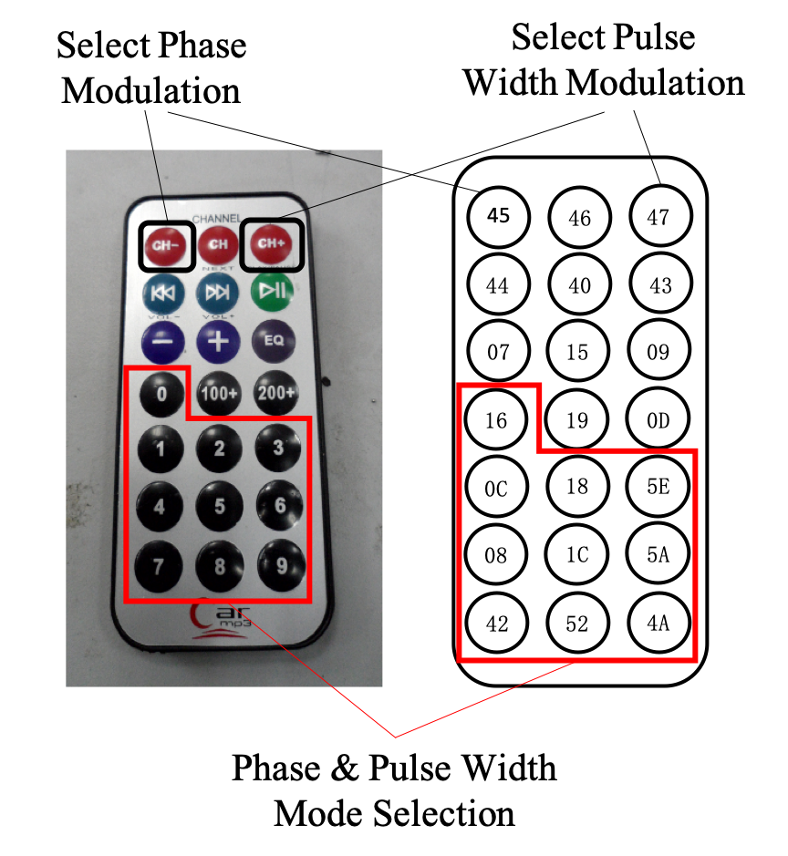

* The infrared remote controller of this signal generator system uses the `UPD6122` infrared encoding chip.
* It uses the NEC encoding format, with a frequency $f=\mathbf{38kHz}$ and a standard transmission distance of approximately 8 meters.
* Data Format of Infrared Remote Controller:
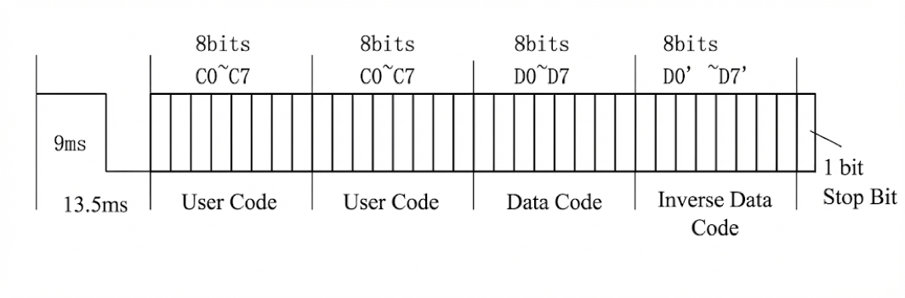
* Relationship between keyCode and Flag Bit led\_2:

| keyCode (Hexadecimal) | Flag Bit led\_2 |
| :---: | :---: |
| 45 | 11 |
| 47 | 00 |
| Others | 01 |


* Relationship between keyCode and $s$:

| keyCode (Hexadecimal) | s |
| :---: | :---: |
| 45 | 00110000 |
| 47 | 00110000 |
| 16 | 00110001 |
| 0C | 00110001 |
| 18 | 00110010 |
| 5E | 00110011 |
| 08 | 00110100 |
| 1C | 00110101 |
| 5A | 00110110 |
| 42 | 00110111 |
| 52 | 00111000 |
| 4A | 00111001 |

* The state machine of infrared remote controller is as following:
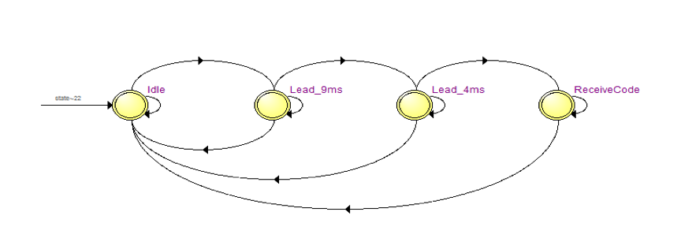

##### 1.3.3 Control Priority

A control priority issue exists between the two control terminals. The design of the Simplified Phased Array Ultrasonic Signal Generator System includes two control terminals: the **Host Computer (PC)** and the **Infrared Remote (IR) Controler**. The control priority of the Host Computer is <font color=red>$higher$</font> than that of the Infrared Remote Controller. A HDL program module named `switch` ($cf.$ [Sec 1.4](#1-4-fpga-implementation-and-rtl)) is responsible for implementing this priority logic using `if-else` statements:

- **High Priority - Host Computer:** The possible outputs from the host computer module include numeric characters `'0'` through `'9'` and lowercase letters `'a'`, `'b'`, and `'c'`. Using `if-else` statements, the control of the `led_2` flag bit ($cf.$ [Sec 1.4](#1-4-fpga-implementation-and-rtl)) is assigned to the host computer when it outputs numeric characters `'0'` ~ `'9'` and letters `'a'` and `'b'`.
	- The `Open Serial Port` button ($cf.$ [GUI](https://github.com/nicewang/Phased-Array-Ultrasonic-Signal-Generator/tree/gui#gui
)) does more than just opening the port; it simultaneously sends the character `'a'` to enter the host computer mode. 
	- The `Close Serial Port` button ($cf.$ [GUI](https://github.com/nicewang/Phased-Array-Ultrasonic-Signal-Generator/tree/gui#gui
)) not only closes the port but also sends the character `'c'` -> Control Authority Handover.

- **Switch Flag:** When the host computer outputs the character `'b'`, the control of the `led_2` flag bit ($cf.$ [Sec 1.4](#1-4-fpga-implementation-and-rtl)) is handed over to the infrared remote controller.

-  **Handover to Infrared Remote Controller:** When clicking the `Close Serial Port` button ($cf.$ [GUI](https://github.com/nicewang/Phased-Array-Ultrasonic-Signal-Generator/tree/gui#gui
)), the control authority is handovered to the infrared remote control terminal.

In summarization, the host computer terminal maintains a higher priority over the two control terminals.


#### 1.4 FPGA Implementation and RTL
The figure below shows the Register Transfer Level (RTL) diagram of the entire system, generated by the Quartus II software. The FPGA implementation method of the simplified phased array ultrasound signal generator can be seen directly from the RTL diagram:
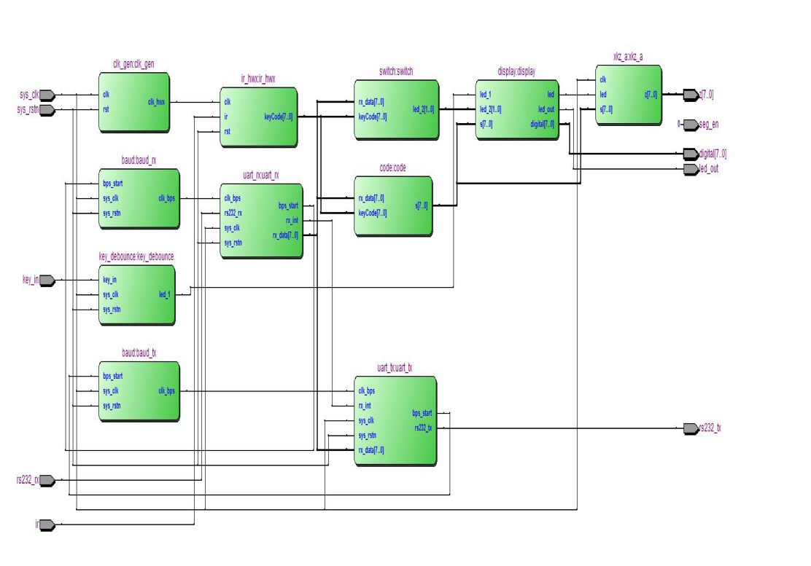

### 2. Improved Phased Array Ultrasound Signal Generator System
#### 2.1 Functional Block Diagram
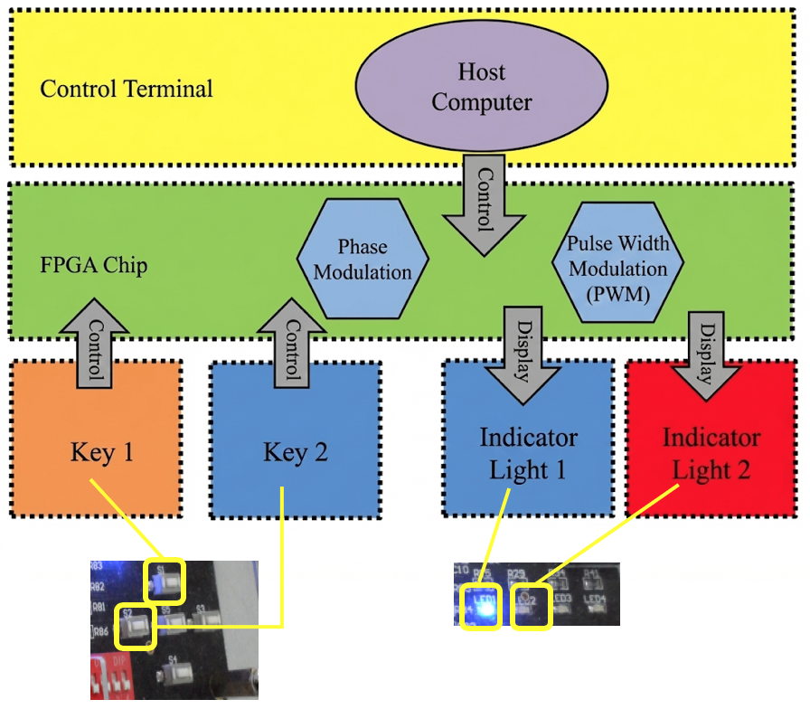

### 3. Peripheral Circuit Module Design
#### 3.1 Amplification Circuit
* Schematic Diagram of Adjustable Vcc Core Circuit:

* Complete Schematic Diagram of Adjustable Vcc Circuit:
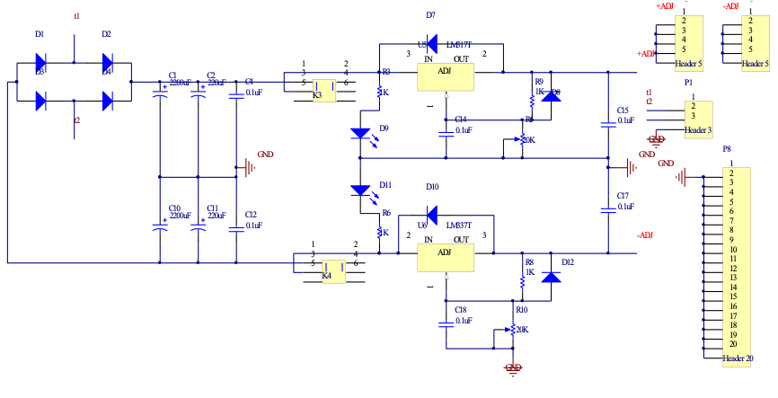
* PCB Layout of Adjustable Vcc Circuit:
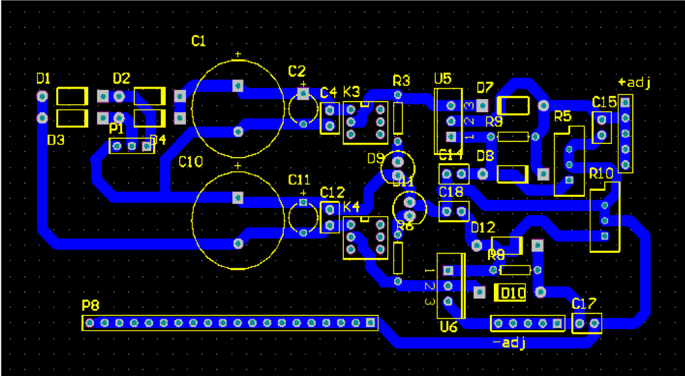

### 4. Simulation Diagram (Waveform)
ModelSim Simulation Waveforms
#### 4.1 Simplified Phased Array Ultrasound Signal Generator
##### 4.1.1 Phase Modulation Simulation
* Phase Modulation Simulation Diagram (Pulse Width: 20ns):
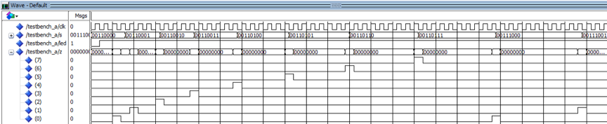
* Phase Modulation Simulation Diagram (Pulse Width: 40ns):
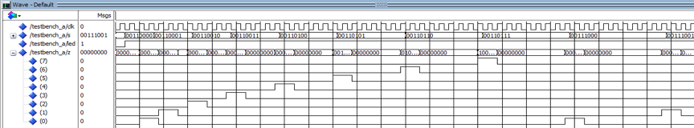
* Phase Modulation Simulation Diagram (Pulse Width: 60ns):
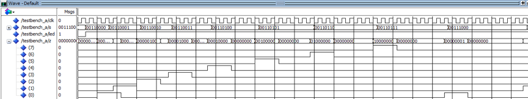
* Phase Modulation Simulation Diagram (Pulse Width: 80ns):
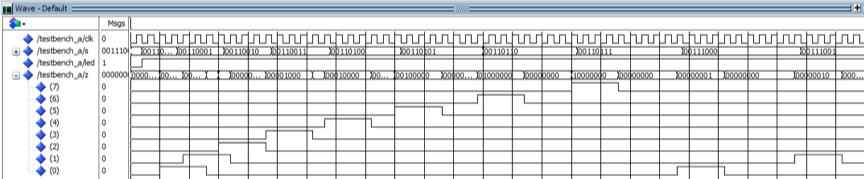
* Phase Modulation Simulation Diagram (Pulse Width: 100ns):
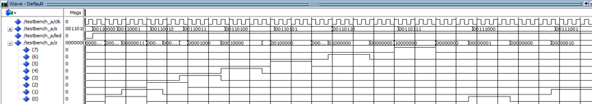
* Phase Modulation Simulation Diagram (Pulse Width: 120ns):
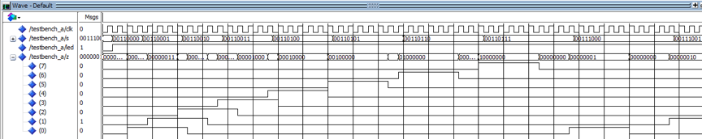
* Phase Modulation Simulation Diagram (Pulse Width: 140ns):
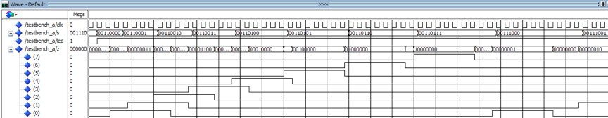
* Phase Modulation Simulation Diagram (Pulse Width: 160ns):
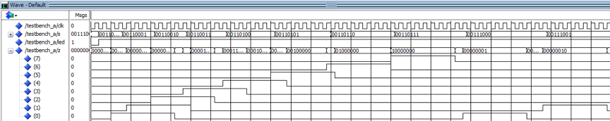
* Phase Modulation Simulation Diagram (Pulse Width: 180ns):
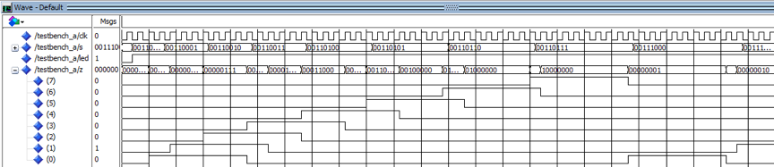
* Phase Modulation Simulation Diagram (Pulse Width: 200ns):
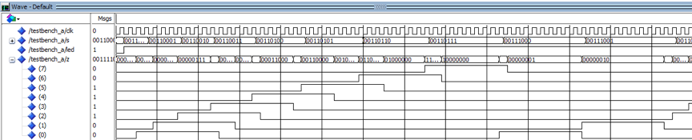

##### 4.1.2 Pulse Width Modulation (PWM) Simulation
* Pulse Width Modulation Simulation Diagram (Phase Modulation Interval: 40ns):
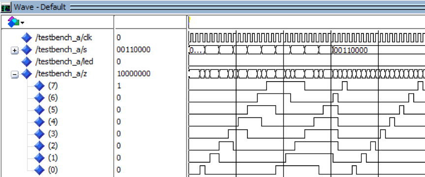
* Pulse Width Modulation Simulation Diagram (Phase Modulation Interval: 60ns):
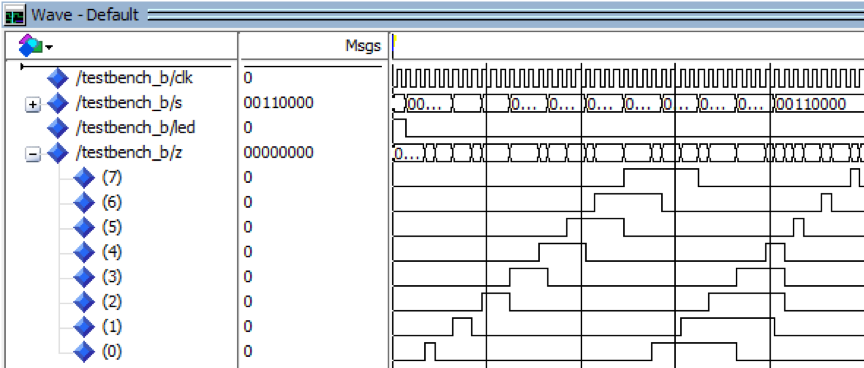
* Pulse Width Modulation Simulation Diagram (Phase Modulation Interval: 80ns):
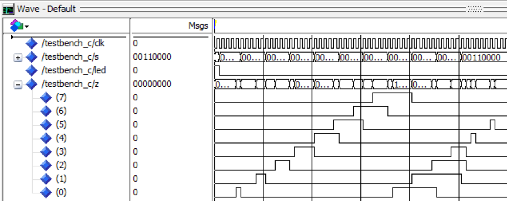
* Pulse Width Modulation Simulation Diagram (Phase Modulation Interval: 100ns):
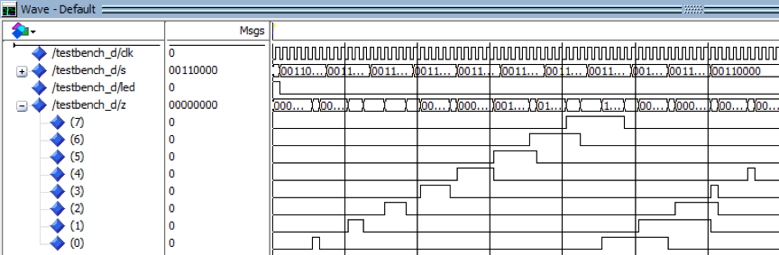
* Pulse Width Modulation Simulation Diagram (Phase Modulation Interval: 120ns):
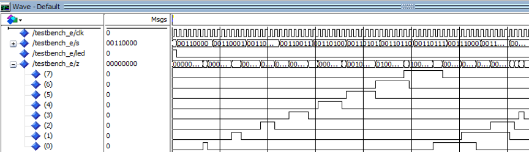
* Pulse Width Modulation Simulation Diagram (Phase Modulation Interval: 140ns):
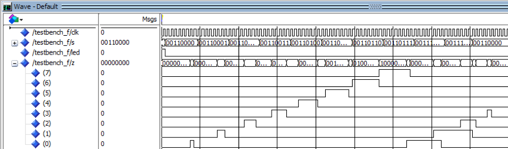
* Pulse Width Modulation Simulation Diagram (Phase Modulation Interval: 160ns):
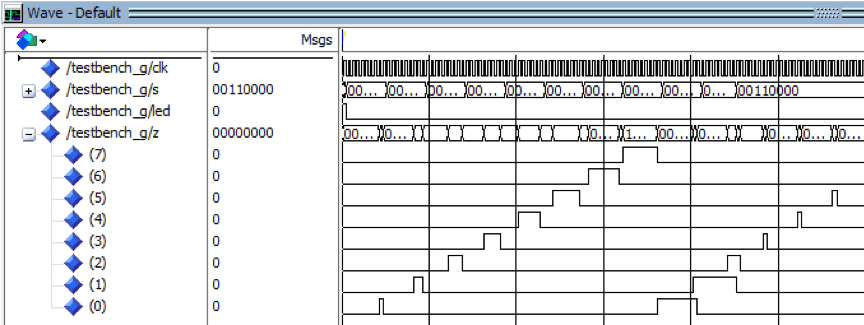
* Pulse Width Modulation Simulation Diagram (Phase Modulation Interval: 180ns):
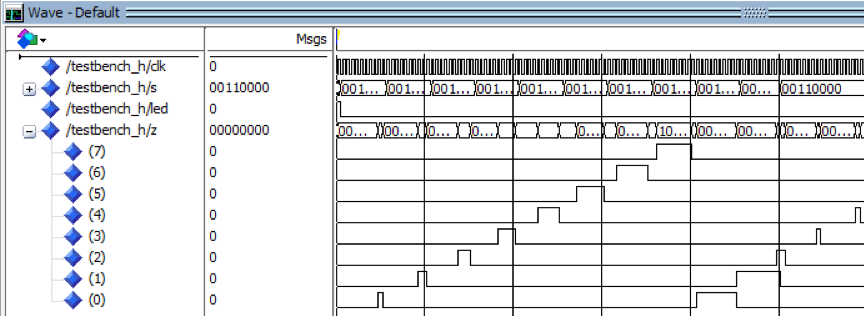
* Pulse Width Modulation Simulation Diagram (Phase Modulation Interval: 200ns):
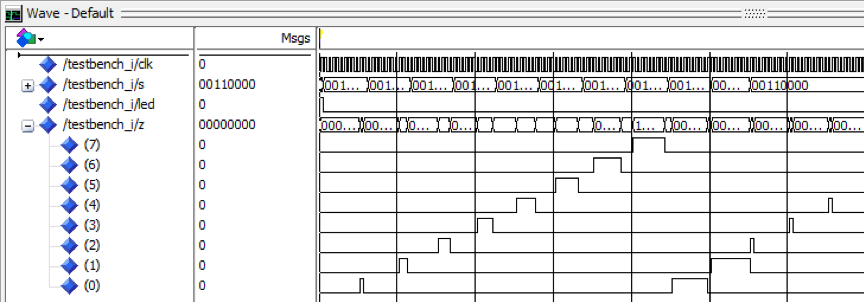
* Pulse Width Modulation Simulation Diagram (Phase Modulation Interval: 220ns):
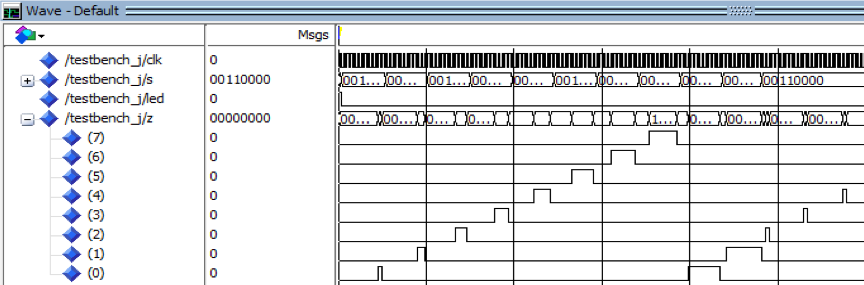

#### 4.2 Improved Phased Array Ultrasound Signal Generator
### 5. Real-World Acoustic Experiments
#### 5.1 Physical Setup
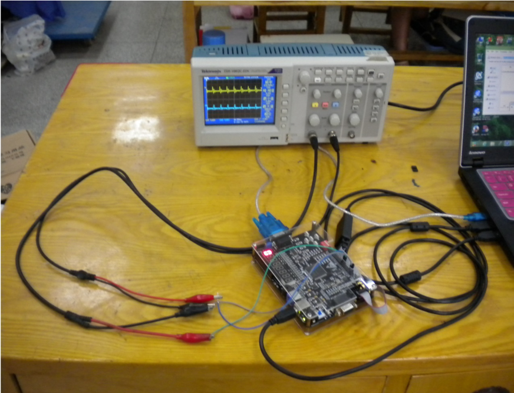
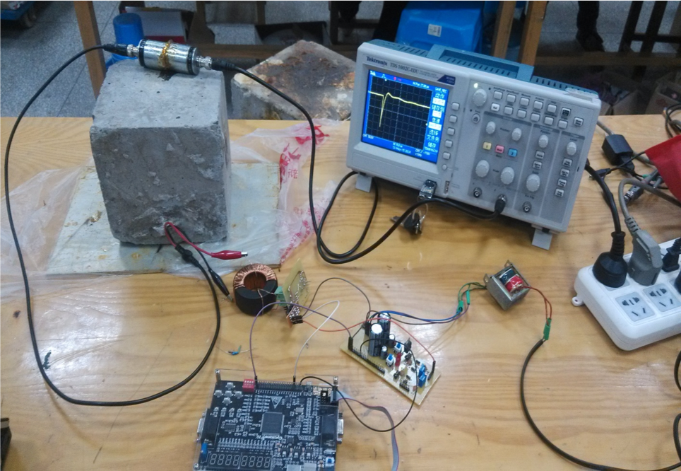
#### 5.2 Acoustic Experiment Waveforms
* Pulse Transmitted by Transducer Excited by a Pulse with a Period of 500μs and a Pulse Width of 200ns:

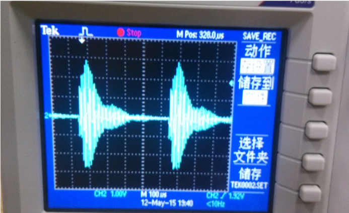
* Pulse Transmitted by Transducer Excited by a Pulse with a Period of 1ms and a Pulse Width of 200ns:


### 6. Final Product Demonstration
#### 6.1 Phase and Pulse Width Modulation (Simplified Phased Array Ultrasound Signal Generator)
[Full Video](https://www.youtube.com/watch?v=729Rt35hbVc)
#### 6.2 Pulse Width Modulation (Improved Phased Array Ultrasound Signal Generator)
[Full Video](https://www.youtube.com/watch?v=Vnu9PueqiJU)